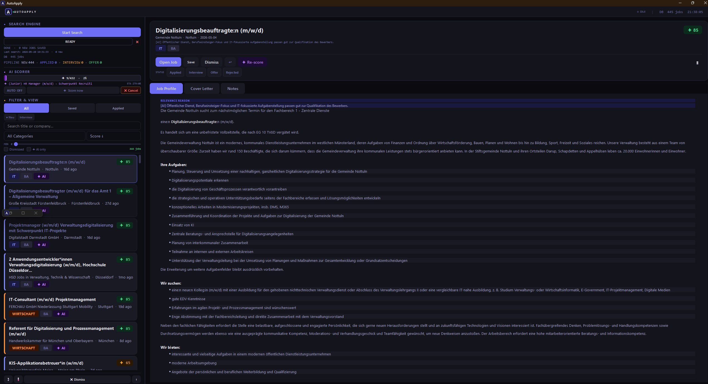
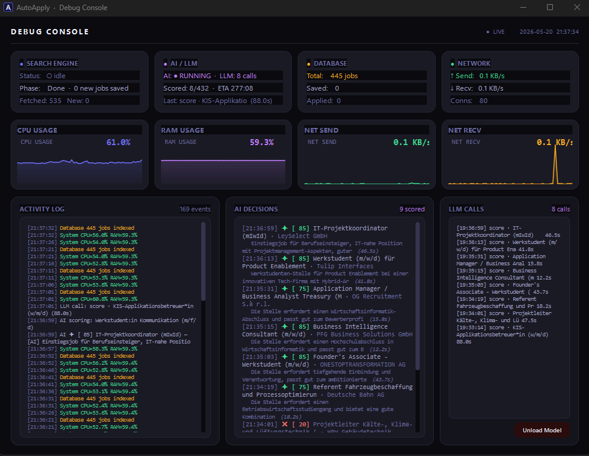

# Application Helper

[](https://python.org)
[](https://www.microsoft.com/windows)
[](LICENSE)

A desktop application that automates job searching, scoring, and application management.
It fetches listings from multiple sources, ranks them using rule-based and AI scoring, and generates personalized PDF applications from a PPTX template.

---

## Screenshots


*Job list with scoring, filters, and pipeline tracking*


*Real-time debug console with system graphs and AI decisions*

---

## Features

- **Parallel job fetching** from Bundesagentur für Arbeit (BA API) and Arbeitnow, with async deduplication
- **Two-stage scoring** — rule-based keyword scoring followed by optional local LLM scoring via Ollama
- **Application pipeline** — track jobs through Applied → Interview → Offer → Rejected
- **PDF generation** — fill PPTX placeholders and convert to PDF via LibreOffice headless
- **Auto-dismiss** — hide jobs with no description or older than a configurable threshold
- **Keyboard-first workflow** — `S` save · `D` dismiss · `A` applied · `B` PDF · `Tab` next unread · `↑↓` navigate
- **Background AI scoring** — scores queued jobs using a local Ollama model without blocking the UI
- **Real-time debug console** — live CPU / RAM / network graphs, search engine state, AI decisions log
- **Standalone executable** — packaged with PyInstaller, no Python installation required for end users

---

## Tech Stack

| Layer | Technology |
|---|---|
| UI | PyQt6 |
| Data | SQLModel · SQLite |
| Async | asyncio · threading |
| AI scoring | Ollama (local LLM, e.g. `qwen2.5:14b`) |
| PDF pipeline | python-pptx · LibreOffice headless |
| Packaging | PyInstaller |
| Python | 3.12 |

---

## Setup

**Requirements:** Python 3.12, [LibreOffice](https://www.libreoffice.org/) (for PDF generation), [Ollama](https://ollama.com/) (optional, for AI scoring)

```bash
# 1. Clone
git clone https://github.com/Sildex/Application-Helper.git
cd Application-Helper

# 2. Install dependencies
pip install -r requirements.txt

# 3. Configure environment
cp .env.example .env
# Edit .env and fill in any required values

# 4. Run
python start.py
```

---

## Build Executable

```bash
pyinstaller autoapply.spec --noconfirm
# Output: dist/AutoApply/
```

---

## Project Structure

```
Application-Helper/
├── app/                   # UI, database helpers, search & scoring engines
│   ├── ui.py              # Main window, all dialogs
│   ├── db.py              # DB access layer (no FastAPI dependency)
│   ├── search_engine.py   # Async job fetching and rule-based filtering
│   ├── ai_score_engine.py # Background AI scoring queue
│   ├── widgets.py         # JobCard and custom Qt widgets
│   └── theme.py           # Palette, stylesheet, widget factories
├── backend/               # SQLModel models, DB engine, API clients
│   ├── models.py
│   ├── database.py
│   └── services/          # BA API, Arbeitnow, AI scorer, LLM service
├── assets/                # Screenshots used in this README
├── docs/                  # Architecture and design documentation
├── scripts/               # Dev utilities
├── start.py               # Entry point
└── autoapply.spec         # PyInstaller build spec
```

---

## Notes

- Job data and the SQLite database are stored locally in `data/` (not tracked by git)
- AI scoring requires a running Ollama instance; the app will attempt to start it automatically
- LibreOffice must be installed system-wide for PDF generation
- Personal CV templates belong in `private/cv/` (gitignored)

---

*Personal project — not licensed for redistribution.*
